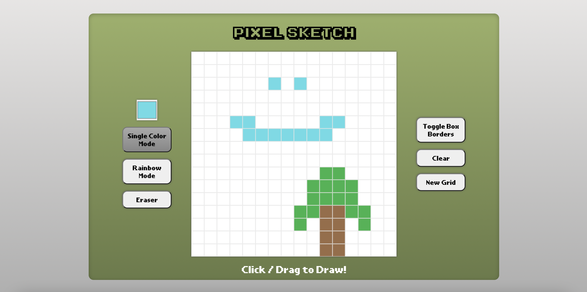
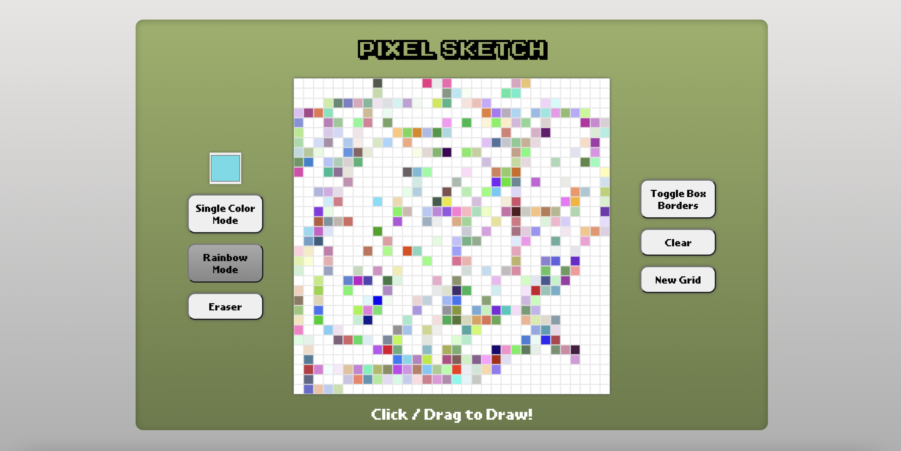

# Pixel Sketch
With Pixel Sketch, you can draw and erase with your mouse on a grid anywhere from
1 giant square to a 100x100 grid! You can pick different colors to use or turn on rainbow
mode to get a RGBA color with each square. You can also toggle the grid lines or clear the grid.

### Website URL
-------------
#### [Pixel Sketch](https://freddylinn.github.io/pixel-sketch)

### Screenshots

